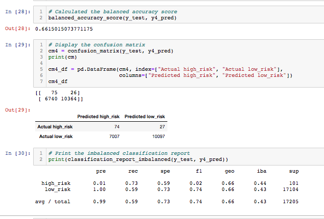

# Credit_Risk_Analysis

## Overview of the Analysis

The purpose of this project was to compare a variety of techniques from different machine learning models to assess each model’s performance in predicting outcomes for a target with highly imbalanced, binary classes.  Given a dataset of 68,817 observations from various loans in 2019, the target variable for this analysis was “loan_status”, a notoriously imbalanced target of binary classes, considering low risk loans are generally administered more often than high risk ones.  Once a dataframe was loaded using pandas in a Jupiter Notebook, the “loan_status” column revealed that the value count for each class was such that “high_risk” loans totaled 347 observations and “low_risk” totaled 68,470.  

Due to the vast imbalance in the two loan status classes, predicting whether a loan status (y) is likely to be high or low risk based on the given features (X) presents extra challenges.  Thus, six techniques from various machine learning models were put to the test to assess each model's ability to overcome these challenges.  The algorithms chosen were derived from imbalanced-learn and scikit-learn libraries.  The techniques involved oversampling (using "naive random" and "SMOTE" oversampling alorithms), undersampling (using "cluster centroid" algorithms) and combinatorial sampling (using SMOTEENN algorithms).  Following this, two ensemble learning techniques were compared (balanced random forest classifier and easy ensemble adaboost classifier). The performance results obtained from each of the six tests are described in detail below.

---------------------------------------------
## Resources:

Data Sources: 
    
    LoanStats_2019Q1.csv

    

Software: 

    Python 3.8.3
    Jupyter Notebook
    Visual Studio Code 1.49.2
    numpy 1.18.5, 
    pandas 1.0.5
    Scikit-learn 0.23.2
    imbalanced-learn 0.7.0
    path 15.0.0
    collections

## Preparation:

To begin the analysis, training and tests variables were split into y (the target) and X (the features to predict the target).  The count was taken to reveal the imbalance of the classes as mentioned prior (68,470 low risk and 347 high risk).  Then the X and y were split into 75% for training and the other 25% of the data was reserved for testing the model afterwards.  A comparison for the counts, before and after the training sets were split, can be seen in the following image:

## Results

The performances of each technique were analyzed by comparing similar metrics.  To visualize the metrics an accuracy score, a confusion matrix, and a classification report for each model were obtained.  Most notably, in the classificaiton report, one can see the precision and senstivity ("recall").  The precision (or "positive predictive value") is calculated by the total number of times a high risk loan was succesfully predicted (true positive) divided by the total number of times a high risk loan was predicted overall (the sum of true positives and false positives).  "Recall" or sensitivity is the ratio of true positives to the sum of true postives and false negatives.  As a bonus, you can also compare the F1 scores ("harmonic means") in the classificaiton report which is a measure of the balance between precision and sensitivity, as calculated by 2(PxS)/(P+S).

To begin the analysis, the oversampling techniques were employed which essentially sought to rebalance the classification discrepancy by increasing the number of samples from the minority set (high risk loans) until the counts are equal in each target class.

### Naive Random Oversampling

Random oversampling is a process where instances of the minority class get selected randomly and then added back into the training set until the classes are balanced. After instantiating imblearn's RandomOverSampler and then fitting and resampling the training datasets, the following results were obtained from naive random oversampling:

- The balanced accuracy score was about 67%.
- The precision of the model to predict high risk loans was only about 1%.  
- The sensitivity (recall) was about 76%

### SMOTE Oversampling

The second oversampling technique employed was "SMOTE" oversampling, which is an acronym for synthetic minority oversampling.  This technique also adds samples to the minority class to balance it with the majority, but, unlike random, SMOTE oversampling increases the minority class by using synthetic instances.  The values of these synthetic instances are created nearby existing values ("neighbors").  After instantiating the SMOTE algorithm to resample the training set, and then applying logistic regression to fit the resampled data and form a prediction of the target based on X_test, this machine learning model resulted in the folliwng metrics:

- The SMOTE technique resulted in a balanced accuracy score of about 66%.
- The precision of the model to predict high risk loans was only about 1%.  
- Finally, the recall was about 63%

### Cluster Centroids Undersampling

Next, an undersampling was employed to see how it fared against the underwhelming results produced prior.  In contrast to oversampling, undersampling seeks to rebalance the classes by reducing the majority to match the minority class count.  In this case, cluster centroid was the technique chosen to undersample.  This method is much like SMOTE in that it introduces synthetic data but in this case it undersamples the majority set.  The results are seen as follows:

- The balanced accuracy score was about 54%
- Precision was roughly 1%
- Sensitivy(recall) was about 67%

### SMOTEENN (combination sampling)

After both over and under sampling techniques were trialed, a combination approach was attempted known as SMOTEENN.  As the name implies this technique incorporates SMOTE (synthetic oversampling).  In addition, the ENN stands for "edited nearest neighbors" which undersamples in order to reduce the potential problems from SMOTE which are susceptable to influence from outliers.  By combining over and under sampling with SMOTEENN, the following results were obtained:

- The balanced accuracy score was 66%
- Precision was approximately 1%
- Recall was 73%

### Balanced Random Forest Classifier

Next, the balanced random forest classifier was used to predict credit risk.  This is a form of ensemble classifier.  Ensemble learning is a process where multiple weak learner models are combined either at once (bagging) or in sequence (boosting) with the purpose of creating a much stronger learner model to improve predictive power overall.  In this case, the balanced random forest classifier randomly under samples each bootstrap sample in order to balance it.  After instantiating the model with at least one-hundred estimators, fitting it to the trained set, and comparing the resulting prediciton to the y_test, the results of this technique were as follows:

- The balanced accuracy score was about 79%
- The precision measured at 4%
- The sensitivity (recall) score was 69%

### Easy Ensemble Adaboost Classifier

Lastly, another ensemble learning algorithm was applied known as the easy ensemble adaboost classifier as a final test.  As the name implies, the adabooster is an adaptive booster which models are created in succession and each proceeding model is learns (is "boosted") by giving extra weight to the errors of the preceeding model to minimize errors.  After instantiating the EasyEnsembleClassifier with at least one-hundred estimators, fitting the model to the training data, and comparing the prediction of the target to the actual result, the following results were obtained for predicting high risk loans:

- The balanced accuracy score was about 93%
- The precision score was about 9%
- The sensitivity (recall) was about 92%

## Summary

After all six tests were implemented to compare the resulting metric scores of each technique, all of the models appeared to produce accuracy scores between 54% and 79%, extremely low precision from 1-9%, and sensitivity scores ranging from 63-76%.  Although the easy ensemble adabooster classifier performed the highest in each metric, it's precision score was still only 9%.  Thus, we can see that each of the models lacked suitable precision (PPV) scores for predicting high risk loans.  That said, many of the parameters for these machine learning models were set to defaults and further adjustments could be made to fine-tune the hyperparamters to make the most of these models.  However, for the purposes of this study, these models appeared to lack the robustness needed for reliably predicting high risk loans, primarily due to the unanimously low precision results obtained.  Nevertheless, exploring the variety of machine learning techniques in the analysis proved to be a worthwhile experiment as it offered an insightful overview for measuring the performance of models in predicting targets with imbalanced classes.